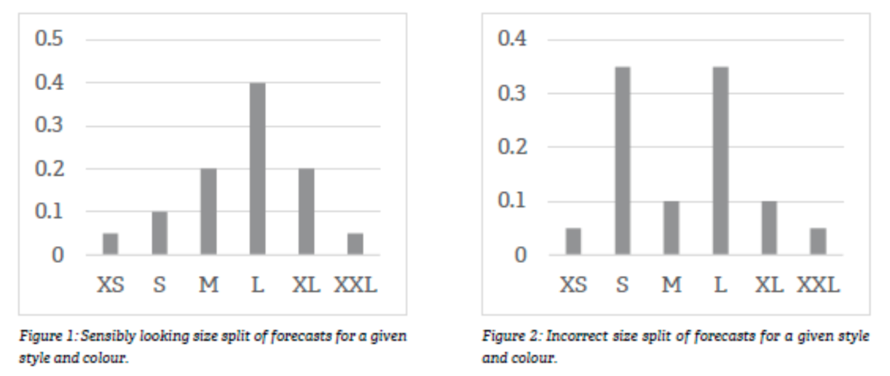

# BESTSELLER Data Scientist Interview Case


## Project structure

The repository is organized to separate concerns by responsibility:

```text
bestseller-case/
├── .github/
│   ├── copilot-instructions.md
│   └── skills/
│       └── grilling/
│           └── SKILL.md
├── data/
│   ├── raw/
│   │   └── fashion_boutique_dataset.json
│   └── processed/
│       └── weekly_sku_features.json
├── docs/
│   └── 2026-08-13 AIFP Data Scientist Case.pdf
├── notebooks/
├── results/
├── scripts/
│   └── run_pipeline.py
├── src/
│   ├── __init__.py
│   └── bestseller_forecast/
│       ├── __init__.py
│       ├── data.py
│       ├── features.py
│       ├── models.py
│       └── evaluation.py
├── .gitignore
├── LICENSE
├── README.md
├── requirements.txt
├── image.png
└── .gitkeep
```

## Workflow

1. Load the raw dataset from `data/raw/`.
2. Build rolling and lag features in `src/bestseller_forecast/features.py`.
3. Train the forecasting model in `src/bestseller_forecast/models.py`.
4. Evaluate metrics in `src/bestseller_forecast/evaluation.py`.
5. Run the full workflow with:

```bash
python scripts/run_pipeline.py
```

## Requirements

Install dependencies with:

```bash
pip install -r requirements.txt
```

---

# Original case brief (original pdf in docs/)

## Forecasting SKU-Level Demand

Forecasting is an essential part of managing the supply chain and to ensure our products are always in stock. In BESTSELLER we have a range of tools to help planners maintain stock levels. In one of these tools, we need to forecast at a weekly granularity four weeks ahead what the demand is at SKU-level.

A SKU in BESTSELLER is a combination of a style, a colour and a size.

**Examples:**
- Round Neck Knitted Pullover, Black, L
- Knitted Pencil Skirt, Natural Melange, XS

---

## Questions

### 1. Model Design

**We want to build an ML model to solve this forecasting problem.**

What kind of model and predictor variables would you consider for this forecasting problem?


Given a specific style and colour, the above model will give forecasts for each size, and we can calculate the proportion each size has of a total. A priori, there is no mechanism to ensure these proportions are sensible, i.e., you get something like Figure 1 and not like Figure 2.




---

### 2. Size Split Consistency

**What can be done to ensure our SKU-forecasts does not in combination give a wrong size split?**

Stockouts represented in the historical sales data will be problematic for the model if not accounted for.

---

### 3. Handling Stockouts

**What options or strategies would you pursue to account for stockouts, so that we use SKU demand rather than SKU sales as target for our forecasting model?**

---

## Guidelines

The purpose of the exercise is to have a foundation for discussion. Please only use a couple of hours on this exercise – we are not looking for a fully detailed solution.

If there are any questions, please do reach out.


## DEV notes
Token optimisation: https://github.com/rtk-ai/rtk
